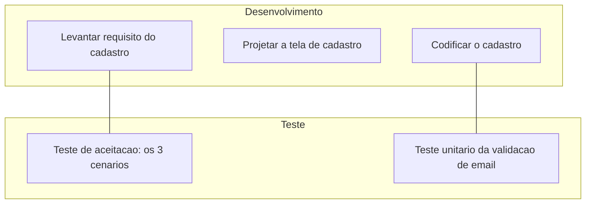
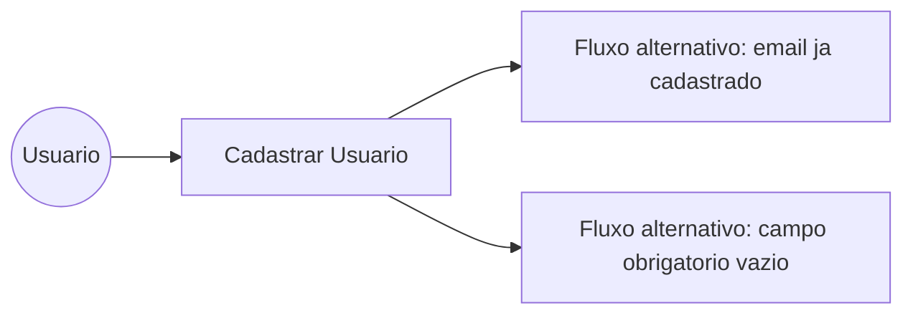

# Exercício Prático: Gerenciando o Teste do Cadastro de Usuário

Esse exercício pega uma única funcionalidade bem simples (um formulário de cadastro de usuário) e acompanha ela do início ao fim, passando pelos quatro temas da disciplina na ordem em que eles realmente acontecem num projeto de verdade. A ideia é explicar cada conceito no momento em que ele entra em cena, então se você está começando agora em qualidade de software, dá pra seguir sem precisar saber nada de antemão.

## O cenário

A funcionalidade é um cadastro de usuário com três campos: nome, email e senha. Duas regras simples de validação: o email precisa ser único (não pode repetir) e todo campo é obrigatório. É de propósito uma funcionalidade pequena, assim o foco fica no processo de teste, e não na complexidade do sistema em si.

## Passo 1 (Tema 1): decidindo como o trabalho vai ser conduzido

Antes de escrever qualquer teste, alguém precisa decidir como o projeto vai ser organizado. "Modelo de ciclo de vida" é só o nome técnico pra isso: a ordem das etapas que o time segue, do início até a entrega.

Como o cadastro de usuário já é uma funcionalidade isolada e pequena, com começo, meio e fim bem definidos, esse exercício segue a lógica do **FDD (Feature Driven Development)**, um dos métodos vistos no Tema 1. Em vez de tratar o projeto inteiro como um bloco só, o FDD trata cada funcionalidade (feature) como um ciclo curto próprio: modelar o que ela precisa fazer, projetar como vai funcionar, e construir. É exatamente esse ciclo que esse exercício está seguindo, começando pela decisão de como conduzir o trabalho antes de sair escrevendo código ou teste.

## Passo 2 (Tema 2): aplicando os princípios e o processo de teste

Com a forma de trabalho decidida, o próximo passo é planejar o teste em si, e aqui entram os princípios vistos no Tema 2. Dois deles se aplicam direto nesse cenário:

"Teste exaustivo é impossível", então em vez de testar toda combinação possível de nome, email e senha, esse exercício escolhe só os cenários que realmente importam: cadastro válido, e os dois jeitos mais prováveis de dar errado (email repetido e campo vazio).

"Teste cedo economiza", por isso os casos de teste desse exercício já estão sendo pensados agora, antes mesmo de existir uma linha de código da tela de cadastro.

Também é nessa etapa que se define o critério de entrada (a tela de cadastro precisa estar pronta pra começar a testar) e o critério de encerramento (só considerar a funcionalidade pronta quando os três cenários passarem). O **modelo V**, também do Tema 2, ajuda a visualizar isso: cada fase de desenvolvimento já nasce com sua fase de teste correspondente, em vez do teste ser pensado só no final.

## Passo 3 (Tema 3): planejando e automatizando o teste

Agora entra o Tema 3. Antes de escrever qualquer teste, ajuda desenhar como o usuário realmente interage com essa funcionalidade, isso é um caso de uso. Aqui está simplificado num diagrama:

Esse diagrama já mostra os três cenários que precisam virar teste: o fluxo principal (cadastro com sucesso) e dois fluxos alternativos (erro). A partir dele, os cenários foram escritos em Gherkin (a linguagem do BDD, Behavior Driven Development), que descreve o comportamento esperado em frases simples, legíveis por qualquer pessoa do time, não só por quem programa. Isso está no arquivo `cadastroUsuario.feature`.

Só descrever o cenário não executa nada sozinho, então cada linha do `.feature` foi conectada a um método Java correspondente, usando o Cucumber. Esse método é quem de fato abre o navegador e realiza a ação, usando o Selenium WebDriver. Isso está no `CadastroUsuarioSteps.java`.

Esses mesmos três cenários também foram documentados no formato de caso de teste do TestLink (`CasosDeTeste_TestLink.md`), com ID, pré-condição, passos e resultado esperado, do jeito que ficariam registrados numa ferramenta de gerenciamento de teste antes de rodar.

## Passo 4 (Tema 4): executando, achando defeito e fechando o ciclo

Com tudo planejado e automatizado, é hora de rodar. Na primeira execução (chamada de Build 1.0), dois cenários passam sem problema, mas o cenário de "email já existente" falha: o sistema deixou cadastrar dois usuários com o mesmo email, quando deveria ter bloqueado.

Esse tipo de falha vira um defeito registrado no Mantis BugTracker (`DefeitoMantis_BUG-101.md`), com todos os detalhes pra quem for corrigir: o que era esperado, o que aconteceu de fato, e os passos exatos pra reproduzir o problema. O defeito nasce com o status "Novo" e vai passando por "Confirmado", "Atribuído" e "Em correção" até alguém resolver.

Depois que o desenvolvedor corrige o problema, o mesmo caso de teste é rodado de novo numa build nova (Build 1.1). Dessa vez ele passa, o relatório do TestLink mostra 100% de sucesso (`RelatorioExecucao_TestLink.md`), e só então o defeito é fechado no Mantis. É esse vai e volta entre execução, defeito e correção que garante que o problema foi resolvido de verdade, e não só empurrado pra outro lugar.

## Fechando o ciclo

Repare que os quatro temas não são blocos separados de conteúdo, eles são etapas de um mesmo processo: primeiro se decide como o trabalho vai ser conduzido (Tema 1), depois se define o que e como testar (Tema 2), em seguida se planeja e automatiza o teste (Tema 3), e por fim se administra o que deu errado até resolver de verdade (Tema 4). Numa empresa de verdade, esse ciclo inteiro se repete pra cada funcionalidade nova que entra no sistema, não é uma coisa que acontece só uma vez.

## Arquivos desse exercício

- `cadastroUsuario.feature`: os três cenários de teste escritos em Gherkin (BDD).
- `CadastroUsuarioSteps.java`: automação dos cenários com Cucumber e Selenium WebDriver.
- `CasosDeTeste_TestLink.md`: os mesmos cenários documentados no formato de caso de teste do TestLink.
- `DefeitoMantis_BUG-101.md`: o defeito encontrado na primeira execução, documentado no formato do Mantis BugTracker.
- `RelatorioExecucao_TestLink.md`: comparação entre a build com defeito e a build já corrigida.
